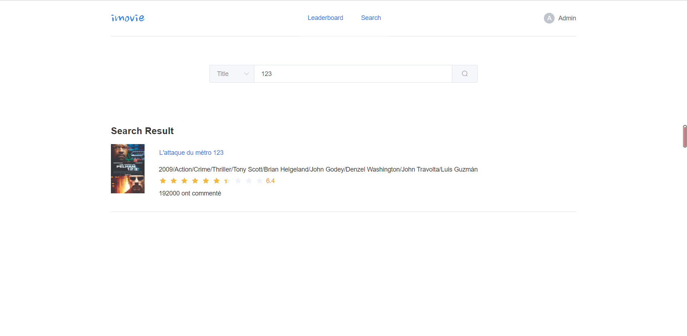

# Projet de l'unité DSIA_5102A - Application Full Stack Data

## Table of Contents

- [Introduction](#introduction)
- [Prérequis](#prérequis )
- [Usage](#usage)
- [Structure du projet](#structure-du-projet)
  * [Docker](#Docker)
  * [Fastapi](#Fastapi)
  * [Postgresql](#Postgresql)
  * [Vue](#Vue)
- [Présentation](#présentation)

## Introduction 

Ce projet consiste en la création d'une application en utilisant [Docker](https://www.docker.com/), [Fastapi](https://fastapi.tiangolo.com/), [Postgresql](https://www.postgresql.org/), [Vue](https://vuejs.org/v2/guide/) qui présente une base de données en ligne sur les films(classement, recommandation, commenter etc.).

## Prérequis 

Environnement et Packages : Tous les détails sont dans [docker-compose.yml](https://github.com/xul-ops/DSIA_projet_fullstack_application/blob/main/docker-compose.yml) et [requirements.txt](https://github.com/xul-ops/DSIA_projet_fullstack_application/blob/main/requirements.txt).

Les données: [imdb_movies.csv](https://github.com/xul-ops/DSIA_projet_fullstack_application/blob/main/app/imdb_movies.csv) - Nous l'avons crawlé en utilisant "Scrapy".

Clonez le git répertoire avec la commande suivante :

```
git clone https://github.com/xul-ops/DSIA_projet_fullstack_application.git
```

## Usage

Lancez Docker, et puis exécutez "docker-compose up" dans le terminal, cela donne le résultat comme ci-dessous.

```
fastapi-backend | INFO:     Will watch for changes in these directories: ['/app']
fastapi-backend | INFO:     Uvicorn running on http://0.0.0.0:5000 (Press CTRL+C to quit)
fastapi-backend | INFO:     Started reloader process [1] using watchgod
fastapi-backend | INFO:     Started server process [8]
fastapi-backend | INFO:     Waiting for application startup.
fastapi-backend | INFO:     Application startup complete.
... ...

```
Entrez http://localhost:5050/#/ dans votre navigateur pour voir la page de login.

## Structure du projet 

Ce projet a utilisé différents outils : 
- [Docker](https://www.docker.com/)
- [Fastapi](https://fastapi.tiangolo.com/) 
- [Postgresql](https://www.postgresql.org/)
- [Vue](https://vuejs.org/v2/guide/)

### Docker 

Nous avons utilisé Docker pour le développement et le déploiement de notre application.

Fichers et dossiers : [Dockfile](https://github.com/xul-ops/DSIA_projet_fullstack_application/blob/main/Dockerfile) de Fastapi, [Dockfile](https://github.com/xul-ops/DSIA_projet_fullstack_application/blob/main/vue/Dockerfile) de Vue, [docker-compose.yml](https://github.com/xul-ops/DSIA_projet_fullstack_application/blob/main/docker-compose.yml)

- [Dockfile](https://github.com/xul-ops/DSIA_projet_fullstack_application/blob/main/Dockerfile) de Fastapi : Il contient les paramètres de Fastapi sur l'image correspondant de docker.

- [Dockfile](https://github.com/xul-ops/DSIA_projet_fullstack_application/blob/main/vue/Dockerfile) de Vue : Il contient les paramètres de Vue sur l'image correspondant de docker.

- [docker-compose.yml](https://github.com/xul-ops/DSIA_projet_fullstack_application/blob/main/docker-compose.yml) : Dans le fichier docker-compose.yml, le conteneur est décrit avec un ensemble de paramètres qui correspondent aux options disponibles lors d’un docker run : l’image à utiliser, les volumes à monter, les ports à ouvrir, etc.

### Fastapi 

Nous avons utilisé Fastapi pour créer des API de manière transparente sans trop d'efforts.

Fichers et dossiers : [Dockfile](https://github.com/xul-ops/DSIA_projet_fullstack_application/blob/main/Dockerfile) de Fastapi, [Dockfile](https://github.com/xul-ops/DSIA_projet_fullstack_application/blob/main/vue/Dockerfile) de Vue, [docker-compose.yml](https://github.com/xul-ops/DSIA_projet_fullstack_application/blob/main/docker-compose.yml)

- [Dockfile](https://github.com/xul-ops/DSIA_projet_fullstack_application/blob/main/Dockerfile) de Fastapi : Il contient les paramètres de Fastapi sur l'image correspondant de docker.

- [Dockfile](https://github.com/xul-ops/DSIA_projet_fullstack_application/blob/main/vue/Dockerfile) de Vue : Il contient les paramètres de Vue sur l'image correspondant de docker.

- [docker-compose.yml](https://github.com/xul-ops/DSIA_projet_fullstack_application/blob/main/docker-compose.yml) : Dans le fichier docker-compose.yml, le conteneur est décrit avec un ensemble de paramètres qui correspondent aux options disponibles lors d’un docker run : l’image à utiliser, les volumes à monter, les ports à ouvrir, etc.

### Postgresql

Dossiers: [models](https://github.com/xul-ops/DSIA_projet_fullstack_application/tree/main/app/models), [routers](https://github.com/xul-ops/DSIA_projet_fullstack_application/tree/main/app/routers), [schemas](https://github.com/xul-ops/DSIA_projet_fullstack_application/tree/main/app/routers), [services](https://github.com/xul-ops/DSIA_projet_fullstack_application/tree/main/app/services)

- [models](https://github.com/xul-ops/DSIA_projet_fullstack_application/tree/main/app/models): Lorsque Fastapi est initialisé, il se connecte à la base de données via le package sqlalchemy, et crée des table définies en même temps.

- [schemas](https://github.com/xul-ops/DSIA_projet_fullstack_application/tree/main/app/routers): Les schémas de données utilisés.

- [services](https://github.com/xul-ops/DSIA_projet_fullstack_application/tree/main/app/services) : Les services font le lien entre la partie gestion métier et la structuration de l'API.

- [routers](https://github.com/xul-ops/DSIA_projet_fullstack_application/tree/main/app/routers) : La combinaison de ces méthodes avec le path des routes vers celles-ci permettent de structurer une API.

### Vue

Dossier: [vue](https://github.com/xul-ops/DSIA_projet_fullstack_application/tree/main/vue)

- [vue](https://github.com/xul-ops/DSIA_projet_fullstack_application/tree/main/vue) : VueJS est un framework Javascript frontend pour créer des interfaces utilisateurs. On retrouve l’organisation par composant. Cette fonctionnalité permet de découper ton application en plusieurs sous-composants qui gèrent chacun leur vie et qui sont réutilisables.

## Présentation

Voici un aperçu du résultat obtenu.

### La page d'inscription 

&nbsp; 


 &nbsp;  
 &nbsp;
### La page de login

&nbsp; 


 &nbsp; 
 &nbsp;
### La page de movielist

&nbsp; 


 &nbsp; 
 &nbsp;
### La page de recherche

&nbsp; 


 &nbsp; 
 &nbsp;
### La page de movie en détail

&nbsp; 

&nbsp; 


